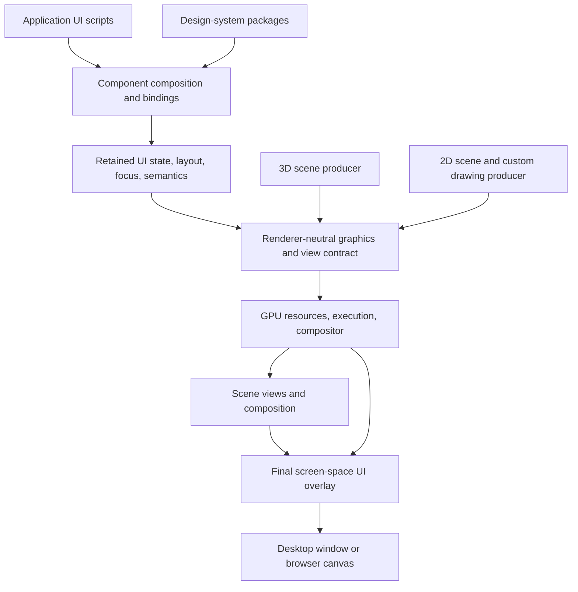

# Unified graphics and scriptable UI architecture

## Status and document roles

**Accepted architectural direction; implementation deferred.** This document
records the rendering and UI design agreed for Weaver. It is not an inventory
of shipped capabilities, a performance claim, or a finalized public API.

- [ADR 9](adr/009-unified-rendering-and-scriptable-ui.md) records the decision,
  scope, alternatives, and consequences.
- [Implementation plan](UI-IMPLEMENTATION-PLAN.md) describes future work,
  decision gates, and validation. Its phases are not completed work.
- This document explains how the pieces fit together and the constraints that
  implementations must preserve.

The direction is **shared accelerated graphics, 3D and 2D scene presentation,
and a modular, scriptable component UI composited above scene content**.
Future spatial presentation is supported through extension contracts, not
bundled as curved-display or VR functionality.

## 1. Goals and initial scope

### Three presentation modes

| Mode | Coordinates and camera | Depth and ordering | Initial responsibility |
|---|---|---|---|
| 3D scene | World space; dynamic camera, with perspective available | Scene depth testing and appropriate transparency handling | Existing and future 3D application/simulation content |
| 2D scene | Flat X/Y space; fixed orthographic camera | Explicit layer/draw ordering; no scene-depth testing by default | Sprites, drawing, charts, maps, and other 2D content |
| UI overlay | Screen-space logical coordinates; orthographic projection | Composited after scene content, independent of scene depth; internal stacking and clipping | Controls, panels, menus, inspectors, and application interaction |

The fixed 2D camera may update its projection/viewport for resizing and display
scale. It does not acquire the 3D camera's perspective, orbit, or mouse-look
behavior. A future movable 2D camera is a separate feature, not assumed here.

A frame can contain 3D content, 2D content, or both. Their view placement and
scene composition order are explicit; merely selecting 2D does not mean that
all 2D content must cover all 3D content.

```text
3D and/or 2D scene views
    -> scene composition and scene-only effects
    -> UI overlay
    -> presentation
```

**UI above all** means above application scene content within the rendered
frame. It does not mean above OS windows, nor that UI ignores its own clipping,
stacking, modal ownership, or child ordering. A scene post-process must not
accidentally obscure or alter the final overlay; UI-specific effects belong to
the UI composition path.

An embedded 3D preview can retain depth inside its own render target, then
appear as an image within an overlay panel. It does not make the overlay itself
subject to the surrounding scene's depth buffer.

### Authoring and reuse goals

- Application and game authors compose UI without having to implement every
  screen in Rust.
- Design systems are replaceable packages above reliable component behavior.
- Ordinary controls and custom GPU visualizations can coexist.
- 2D scenes and UI share rendering infrastructure, not necessarily components,
  entity lifecycles, or one universal scene graph.
- Native desktop and browser/WASM use the existing platform-shell direction.
  Mobile portability is an architectural intention, not a shipped mobile SDK.
- Execution remains bounded and observable; UI does not own simulation or
  network timing.

### Explicit non-goals for the initial implementation

- VR/OpenXR runtime integration, stereo scheduling, tracking, or controllers.
- Built-in diegetic UI, plane/cylinder surface libraries, curved displays,
  arbitrary spatial mapping, or headset demonstrations.
- Native mobile packaging and platform integrations.
- A complete Material UI clone, universal CSS/DOM compatibility, or unchanged
  execution of existing React DOM component libraries.
- A general game scripting system, editor, physics engine, or production asset
  pipeline. UI-scoped scripting does not reopen all deferred bootstrap work.
- A mandatory Tauri, Electron, embedded-browser, or local HTTP service shell.
- Automatic support for untrusted scripts/shaders, certified realtime behavior,
  or a numerical performance guarantee.

## 2. Product and codebase boundaries

This capability belongs to Weaver. Woven continues to own its public protocol,
routing, ownership, channel policy, and bounded network execution. UI and
simulation behavior must not enter `woven-core` or `woven-protocol`. Consumers
still use the supported Woven protocol/client path; Host is not a data-plane
proxy.

Woven Host owns hosted identity, entitlements, billing, and provisioning. Weaver
may consume Host APIs explicitly, but its local UI and renderer must not require
Host authentication or commercial account state.

Within Weaver, the responsibilities are:

| Responsibility | Architectural home |
|---|---|
| Simulation/application state, validated actions, load scheduling | Application/domain services |
| Component composition, local UI state, bindings | UI scripting/composition layer |
| Layout, component semantics, focus, input routing | UI runtime and platform adapters |
| Renderer-neutral drawing, view and composition descriptions | Shared graphics contract, building on `weaver-render` |
| GPU resources, pipelines, execution, compositing | Graphics backend, building on `weaver-render-wgpu` |
| Window/canvas lifecycle, DPI, platform events, text/accessibility integration | Desktop/web shells and their platform adapters |

These are responsibilities, not a mandate to create a crate for each row.
Implementation should prefer current seams and introduce packages only when
real dependencies and behavior justify them.

`SceneSnapshot` remains a description of visible scene state. It must not become
the application widget store, scripting heap, network result model, or universal
mutation interface. Future UI observations and draw descriptions can be separate
from simulation snapshots while participating in the same frame composition.

## 3. Current foundations and gaps

The following is source-level evidence at the time of this decision, not
performance validation. The working checkout includes the platform-shell work;
implementers must recheck these details before changing code.

| Source | Existing foundation | Important limitation |
|---|---|---|
| [`SceneSnapshot`](../crates/weaver-render/src/snapshot.rs) | Camera, meshes, sprites, particles, text, UI vocabulary, revision | One existing scene description, not an external component/state API |
| [`UiElement`](../crates/weaver-render/src/ui.rs) | Rectangles, images, text, clipping-group vocabulary | Vocabulary does not imply full backend behavior |
| [`WgpuRenderer`](../crates/weaver-render-wgpu/src/render.rs) | Scene rendering followed by UI/text without a depth attachment | UI extraction currently handles top-level rectangles only; sprites use a simplified texture-selection path |
| [`UiPipeline`](../crates/weaver-render-wgpu/src/ui.rs) and [`UI_SHADER`](../crates/weaver-render-wgpu/src/pipeline.rs) | Instanced rectangle drawing and rounded-box shader | Fixed 250-rectangle ceiling; draw data rebuilt/uploaded and bind groups created in the render path |
| [`TextPipeline`](../crates/weaver-render-wgpu/src/text.rs) | Glyphon/Cosmic Text, retained shaping buffers when text/size are unchanged, glyph atlas | Not a full text-editing, accessibility, or UI-layout subsystem |
| [`GpuTexture`](../crates/weaver-render-wgpu/src/resource.rs) | RGBA upload and sampled textures | Not a general render-target, compute-surface, region-update, or readback API |
| [`WeaverApp` / `InputFrame`](../crates/weaver-app-core/src/lib.rs) | Shared application, asset, controller, and input vocabulary | Current input is camera/action oriented; it does not implement component focus or rich pointer/text semantics |
| [Desktop shell](../crates/weaver-platform-desktop/src/lib.rs) and [web shell](../crates/weaver-platform-web/src/lib.rs) | Native and browser lifecycle/input/render composition | No completed portable scripted UI runtime; browser labs remain offline |
| [`Command`](../crates/weaver-core/src/commands.rs) and [`Event`](../crates/weaver-core/src/events.rs) | In-process command/event abstraction | `Box<dyn Any + Send + Sync>` is not a serialized scripting or IPC contract |
| [Managed soak runner](../examples/woven-lab/src/soak.rs) | Bounded traffic scheduling independent of rendering, versioned JSON result | Specialized runner, not a general multi-target UI service |

No package selection, existing guidance, or screenshot should be interpreted as
proof that the proposed system is already implemented.

## 4. Architecture: shared graphics, specialized producers



UI and 2D drawing share a graphics substrate. UI additionally has semantics:
layout, focus, activation, selection, text editing, accessibility, and component
state. Game objects, chart traces, and drawing operations must not be forced to
be UI widgets to gain GPU acceleration.

The shared contract describes resources, geometry/draw operations, transforms,
materials, clipping, targets, views, and ordering. Producers may retain different
structures and update them differently:

- UI retains component identity and incrementally invalidates affected work.
- A scene updates many transforms without reconciling a widget tree.
- A visualization updates a data buffer and a few material parameters.
- A mostly static panel reuses cached content.

Sharing graphics does not require a single high-level object model or copying an
entire scene/component tree into scripts every frame.

### Coordinate and view contracts

Implementations must document conversions among world, view, logical UI,
physical target-pixel, and texture UV coordinates, including axis direction and
UV origin. DPI scaling, viewport offsets, resizing, and aspect policy must be
explicit and testable. Visual clipping and hit testing must agree.

Scene depth, 2D ordering, and UI stacking are distinct policies. Transparent
operations preserve necessary ordering; batching cannot reorder overlapping
content merely to reduce state changes.

## 5. Modular components and design systems

### Foundation behavior

A small reliable foundation should supply layout containers, text/images,
pressable controls, editable text, scrolling, selection, focus policies,
overlay ownership, and semantic accessibility descriptions. Platform adapters
provide the necessary text/input and accessibility services.

A theme must not reimplement text selection or keyboard navigation simply to
change the appearance of a field.

### Design-system packages

A design system combines semantic tokens and component recipes:

- Color roles, typography, spacing, radii, and elevation.
- Component variants and state-dependent appearance.
- Motion and reduced-motion behavior.
- Icons/assets and bounded custom materials.
- Composite components built on foundation behavior.

A Material-inspired package, compact operator-console package, and game HUD kit
can coexist. Material UI is an authoring/design analogy, not a selected dependency
or the engine's definition of UI. Existing MUI/React DOM components depend on
browser facilities and do not automatically execute on a WGPU renderer.

Application components add domain behavior such as entity inspectors, session
browsers, inventories, and test configuration. They call validated application
capabilities rather than replacing engine authority.

### Sharing with Host

Host's React/TypeScript stack, semantic CSS tokens, status/field patterns,
validation practices, cancellation handling, and frontend tests are useful
references. Share genuinely portable tokens and pure components/contracts where
appropriate; a GPU design system may require a different component implementation
than a DOM frontend.

Do not import the entire Host application, Firebase bootstrap, account-capacity
providers, entitlement navigation, or broad global stylesheet into Weaver.
Neutral token data can generate platform-specific representations instead of
maintaining unrelated palettes by hand.

## 6. Script authoring and application authority

A scripting layer manages composition, local UI state, bindings, navigation, and
event handlers. TypeScript/JSX is a preferred candidate because of browser tooling
and existing ecosystem familiarity, **not a finalized language, interpreter, or
framework decision**.

JSX is syntax; it does not require React. React with a custom renderer and a
smaller reactive/JSX runtime have different implementation costs. Lua is another
candidate if native embedding constraints outweigh browser authoring reuse.
Choose using a focused desktop/browser prototype, not familiarity alone.

The following illustrates intent only; it is not an existing or frozen API:

```tsx
function SessionPanel({ session }) {
  return (
    <Panel variant="surface">
      <Stack gap="medium">
        <Heading>Session</Heading>
        <Slider
          label="Simulation speed"
          value={session.timeMultiplier}
          onChange={(value) => session.requestTimeMultiplier(value)}
        />
        <Button onPress={() => session.requestPause()}>Pause</Button>
      </Stack>
    </Panel>
  );
}
```

Portable components must not require `document`, DOM element types, or browser
mouse-event objects. Semantic events such as activation and value changes can be
supplied by different input adapters.

### State and execution ownership

| UI/scripts own | Rust/application services own |
|---|---|
| Draft values, selected tabs, filters, local component state | Authoritative world/application state and permissions |
| Composition, bindings, navigation, event handlers | Validated commands, revision changes, simulation lifecycle |
| Requests to start/stop or adjust an operation | Scheduling, connection ownership, resource caps, cancellation enforcement |
| Presentation preferences and declared transitions | GPU execution/resources and bounded observation delivery |

The existing in-process `Command`/`Event` types require adapters if crossing a
language or process boundary. Use versioned, runtime-validated contracts,
explicit request/result identity, and exact 64-bit representations such as
decimal strings. Do not maintain divergent handwritten public models in Rust and
TypeScript without conformance checks.

Scripts submit bounded batches of changes. Validate before committing a new UI
state, preserve the last valid committed state on rejection/failure, and report
errors. A renderer should not synchronously wait for arbitrary script callbacks
while encoding each draw.

Use bounded state projections rather than raw packets/full snapshots for UI
observation. A slow observer must not block simulation or a load runner. Run and
target identities, revision/sequence, freshness, and cancellation acknowledgements
are explicit; independently targeted Woven nodes remain independent domains.

UI time/lifecycle is separate from simulation time. Pausing the world must not
freeze menus or the stop button. Declarative transforms, opacity transitions,
and other supported animations can execute below the scripting boundary without
rebuilding components every frame.

### Trust and isolation

Initially prefer explicitly trusted/local scripts. Native JavaScript embedding
adds execution, interruption, memory, and host-capability requirements; it is not
an automatic sandbox for third-party mods. Browser JavaScript also needs resource
and lifecycle discipline. Runtime/thread/process placement remains a decision
needed before implementation can promise isolation from a stalled script.

Scripts do not receive ambient filesystem, network, credentials, GPU device, or
arbitrary world-memory access. Any exposed capability is explicit and bounded.
If a future bridge uses loopback HTTP/WebSocket, require authentication, origin
checks, bounded requests, and cleanup; loopback binding alone is insufficient.
That bridge would be Weaver IPC, not a new Woven data-plane transport.

## 7. Rendering and compositing facilities

### Batched primitives

Use simple geometry and compact instance/draw data for common shapes, images,
and glyphs. Candidate mechanisms include instanced quads, analytic shape shaders,
image/glyph atlases, and scissor/stencil clipping. Paths can be introduced when
needed; a complete vector implementation is not a prerequisite for the first
working control.

Persist useful buffers and resource bindings. Update changed ranges where
beneficial. Respect material, texture, clip, and transparency ordering when
batching. Fixed per-batch limits must produce additional bounded batches or
explicit rejection, not silent disappearance of valid content.

### Cached surfaces

Rendering a costly, mostly static subtree to a texture can avoid repeated layout,
shaping, and paint work. Transform/opacity changes may reuse that texture. Cache
validity must account for content, size, scale, style, clipping, and relevant
material inputs.

Do not allocate an offscreen texture for every widget. Caches consume memory,
render-target transitions, and bandwidth; mobile tile-based GPUs make indiscriminate
caching particularly risky. Retaining draw data and caching rasterized pixels are
separate optimizations.

A normal presented frame still composites its visible content; retaining UI state
does not guarantee that an acquired swapchain image contains last frame's pixels.
Idle redraw suppression must respect platform/presentation behavior.

### BLIT and composition

A texture copy moves compatible regions without scaling, filtering, or blending.
A textured draw composes a surface with transforms, filtering, opacity, and blend
rules. Both are useful, but the API and measurements must distinguish them.

Document target formats, linear/sRGB conversion, alpha convention, filtering,
and clipping. Prevent accidental double color conversion or inconsistent alpha
handling across ordinary components, caches, effects, and scene previews.

### Custom materials and shader surfaces

Custom GPU visual components are first-class consumers of the shared graphics
layer, not CPU bitmap escape hatches. A logical material/surface facility should
support defined texture/buffer inputs, uniforms, output bounds, update cadence,
and quality/resolution choices.

The following is an illustrative declaration, not a committed API:

```tsx
<ShaderSurface
  material={materials.spectrum}
  inputs={{ samples: spectrumTexture }}
  uniforms={{ intensity, color }}
  resolutionScale={0.5}
/>
```

Compile and cache material pipelines outside ordinary draw submission where
possible. Report shader/pipeline errors without silently substituting unrelated
content. Define which last-valid resources can remain usable after failure.
Rust retains GPU resource/lifetime ownership; scripts use validated logical
handles and bounded parameter/data updates.

Multi-pass effects and compute-generated images require explicit resource
read/write dependencies and bounded intermediate targets. Grow dependency
planning as real effects need it; this is not approval to build a speculative,
universal render graph before there is a consumer.

Shader validation establishes API/type correctness, not cheap execution or safe
GPU preemption. Initially use reviewed/local shader assets and bounded effect
resources. Do not claim that resource limits alone make arbitrary shaders safe.

### Pixel manipulation and GPU residency

| Work | Preferred path |
|---|---|
| Small or occasional edits | CPU pixels with validated, bounded region upload |
| Filters, brush operations, procedural imagery | Fragment shader or supported compute path |
| Large continuously changing visualization | GPU-resident resources plus compact data/parameter updates |
| Screenshots/export/CPU inspection | Explicit asynchronous readback with documented latency |

Avoid CPU pixel loops, full-surface uploads, and synchronous readback as default
component behavior. For scale, a 3840x2160 RGBA8 buffer is about 31.6 MiB; replacing
it at 120 Hz transfers about 4.0 GB/s of upload data before overhead. This is a
size/rate calculation, not a measured device bandwidth or performance result.

Sharing the same device permits UI targets, 2D effects, and 3D previews to be
sampled without CPU transfer. That does not imply automatic zero-copy sharing
across devices, processes, or browser/native boundaries.

## 8. Invalidation and performance contracts

GPU acceleration is not a speed guarantee. Browsers and many native systems
already accelerate graphics. Avoiding unnecessary CPU work, uploads, state
changes, render passes, overdraw, and synchronization is the actual objective.

| Change | Expected invalidation policy |
|---|---|
| Text/font/wrapping constraint changes | Affected shaping/layout and paint |
| Layout constraints or child structure changes | Affected layout dependencies and paint |
| Color/visual variant changes | Paint/material data, not unrelated layout |
| Compositor transform/opacity changes | Composition data; reuse content where valid |
| Shader parameter or source-data changes | Relevant material/data updates and dependent surface |
| Viewport/DPI changes | Relevant layout, raster scale, targets, and coordinate mappings |

Dependencies can cause changes to propagate to parents or children; incremental
invalidation is not a promise that every change touches exactly one node.
Virtualize large collections, bound telemetry history, and maintain stable
component identities. Account for glyph-atlas and surface-cache churn.

Choose resource caps and quality profiles for node counts, mutation/event queues,
texture dimensions/bytes, buffers, uploads, effect passes, retained observations,
and pending jobs. Exceeding a cap is observable rejection or an explicitly
selected quality reduction, never a hidden delivery/success claim.

Measure CPU composition/layout/shaping/encoding, allocations, bytes uploaded,
GPU pass time where supported, draw/pipeline counts, cache behavior, memory,
frame-time tails, and input-to-present latency. Record hardware, backend, target
resolution/DPI, content, warm/cold state, and enabled capabilities. CPU and GPU
work may overlap; their timings are not a simple universal sum.

Initial budgets must be established from offline baselines and reference
hardware. No FPS, latency, energy, or deterministic real-time promise is made by
this architecture. Acceptance must include idle/static UI, changing text,
scrolling, shader content, cache invalidation, and coexistence with 3D work, not
only an attractive shader demonstration.

## 9. Input, text, and accessibility

UI routing happens before unconsumed input reaches scene controls. A text field
must not trigger movement/time shortcuts; scrolling a panel must not zoom the
scene behind it. Define pointer capture, focus, modal ownership, cancellation,
and behavior when components disappear or a platform loses focus.

Use pointer identities and input-source metadata rather than one global mouse
slot. The initial implementation can use mouse/keyboard while remaining suitable
for later touch/spatial adapters. Pointer capture maintains interaction ownership;
the presentation adapter separately defines how coordinates behave outside a
surface's bounds.

GPU rendering does not supply IME, selection, caret behavior, clipboard,
accessibility trees, or mobile keyboards. Use platform text/accessibility
facilities through documented adapters. In a browser, DOM elements may be used
for semantic/text-input integration without becoming the graphics source of truth.
Synchronize their bounds, focus, content, and lifecycle with visible components.

The first substantive UI proof must include editable text, keyboard navigation,
focus transfer, clipping, and resize/DPI behavior. Buttons alone hide the hardest
portability costs. Unsupported platform services must be documented, not treated
as automatically implemented by canvas rendering.

## 10. Extension support, not bundled spatial features

The core must not assume every UI root fills an OS window, every presentation is
flat, there is only one input source/view, or content repainting is inseparable
from a presentation transform.

Separate three contracts:

1. **Content:** logical 2D extent, committed UI state/draw content, optional GPU
   target, resource ownership, validity, and lifetime.
2. **Presentation:** how that content is drawn, with a view/transform, geometry,
   material, target, and composition policy supplied by the consumer/adapter.
3. **Interaction:** how an external hit becomes UI-local coordinates and a
   semantic input event, with pointer/focus ownership above the mapping.

These describe responsibilities, not finalized trait names or a plugin ABI.
Their built-in initial consumer is screen-space overlay presentation.

### What a future extension could do

A diegetic-display extension could render content to a texture, apply it to its
own world-space geometry, and map ray intersections through UV coordinates to
logical UI coordinates. A curved display could supply cylindrical or arbitrary
mesh mapping. Rendering and hit mapping must agree on geometry, parameters,
transforms, clipping, UV origin, visibility, and relevant state revisions.

Such an extension would own occlusion/range/front-face interaction rules,
sampling/raster-scale choices, and lit/emissive display materials. These are not
new hardcoded widget behaviors. A future XR adapter would additionally own
runtime sessions, views, tracking, timing, and controller providers; runtime
composition-layer support is not assumed.

UI content may be reused across views; pose/view updates need not repaint it.
Direct world-space drawing is another possible consumer and need not always use
a rasterized UI texture. Neither approach is delivered by this documentation.

### What is not required now

No plane/cylinder component API, curved geometry generator, spatial ray mapper,
VR dependency, headset test, or multi-view renderer is part of the initial
feature set. Prove extensibility with a small test-only adapter that exercises
ownership and coordinate/input contracts, not a shipped spatial implementation.

**Supported by architecture** means an extension can be added through defined
contracts without rewriting core components. It is not a claim that future
runtime/platform compatibility has already been tested.

## 11. Platform and capability policy

The primary portable graphics path is native WGPU and browser canvas rendering
through WGPU/WebGPU, with the existing WebGL2 fallback respected. This is not a
DOM component library with an assumed accelerated native backend.

Capabilities are explicit. Compute, storage resources, formats, sampling,
limits, and measurement facilities differ across adapters; a WebGL2 path must
not pretend to provide WebGPU compute semantics. A component declares its
requirements and offers a tested alternate path, an explicit quality tier, or a
clear unsupported result. Do not silently hide rejected controls/effects.

Maintain equivalent component semantics where supported, rather than promising
bit-identical pixels across fonts, GPUs, and platforms. Browser and native
execution share the contract but may use different host mechanisms for scripts,
text input, and accessibility. Mobile and XR remain future integrations.

A web controller of a native service, DOM-oriented frontend, Qt/QML/Slint UI, or
Tauri/Electron shell remains a possible consumer/delivery strategy when useful.
None is required by this rendering decision or replaces the GPU component
foundation. Published package availability and platform support need separate
verification before any dependency is selected.

## 12. Open implementation decisions

The ADR commits the direction and scope, not every mechanism. Resolve these
through the [implementation plan](UI-IMPLEMENTATION-PLAN.md):

- Scripting language, compilation/tooling, component runtime/reconciler, native
  interpreter, and execution/isolation topology.
- Layout implementation and text/editing/accessibility adapter selection.
- Public draw/view/target contracts and whether actual responsibilities justify
  new crates; preserve renderer-neutral versus backend-specific boundaries.
- Mutation/state observation schemas, lifecycle/recovery, and resource limits.
- Material interfaces, effect dependency planning, and capability/quality tiers.
- Measured reference budgets and cache/virtualization policies.
- Packaging and optional design-token/component reuse with Host.

Do not add empty runtime modules, speculative VR scaffolding, or dependency
commitments just to make this document look implemented.

## Related decisions

- [ADR 2: renderer-neutral snapshots](adr/002-renderer-neutral-snapshot.md)
- [ADR 3: WGPU backend](adr/003-wgpu-backend.md)
- [ADR 6: fixed simulation updates and independent rendering](adr/006-fixed-simulation-independent-rendering.md)
- [ADR 8: deferred features](adr/008-deferred-features.md)
- [ADR 9: unified rendering and scriptable UI](adr/009-unified-rendering-and-scriptable-ui.md)
